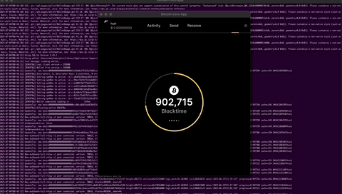

# Bitcoin Core App

Expirimental build configuration:

- bitcoin/bitcoin is included as a git submodule `bitcoin/`
- `qml/` directory is pulled from bitcoin-core/gui-qml
- `bitcoin-core-app` is built from both `bitcoin` and `qml` directories

Currently, this works for me on arm64/macos:

```
git clone https://github.com/pinheadmz/bitcoin-core-app
cd bitcoin-core-app
git submodule update --init --recursive
cmake -B build
cmake --build build -j 8
build/bin/bitcoin-core-app
```

